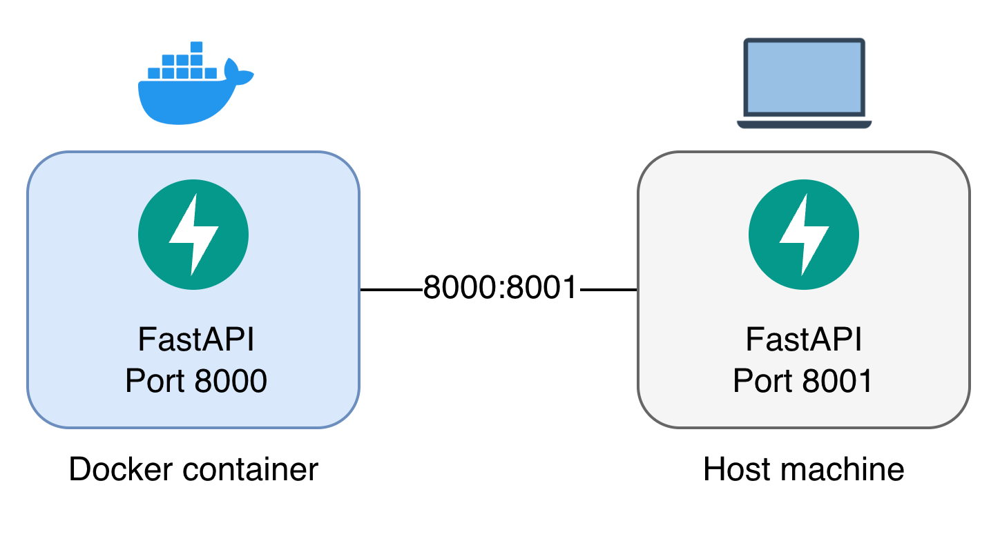

<p align="center">
  
</p>

# tinyapi

Minimal FastAPI service exposing two endpoints for health checks and random number generation.

## Network Configuration

<p align="center">
  
</p>

## Commands

```bash
make install                    # Install dependencies
make run                        # Run the server (on port 8001)
make test                       # Run tests
make docker-build               # Build image
make docker-run                 # Build image and run container
make docker-run-indefinitely    # Build image and run in background indefinitely
make docker-stop                # Stop and remove container
make start-locust               # Start Locust
make stop-locust                # Stop Locust
```

## Author

Allister K.

## License

MIT License - see [LICENSE](LICENSE) for details.
