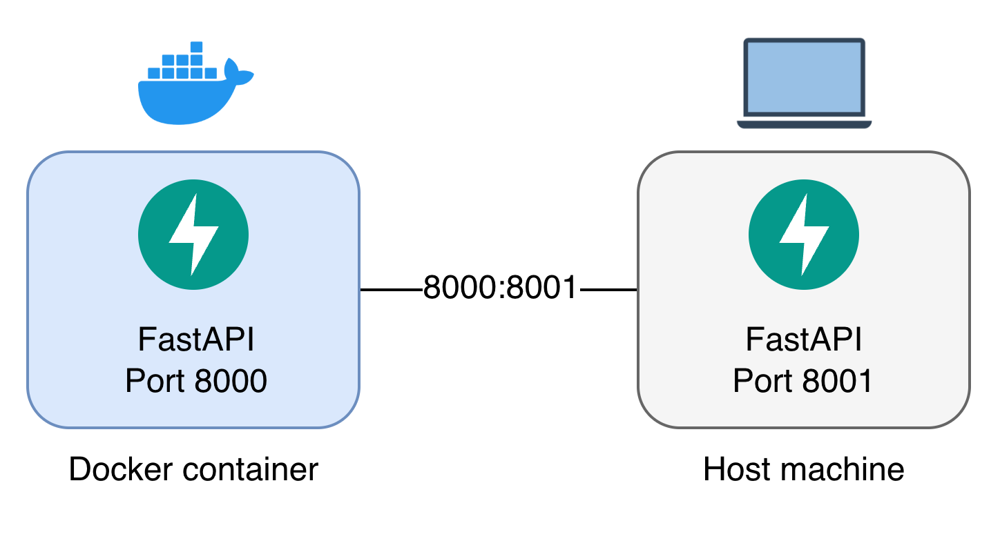

<p align="center">
  
</p>

# tinyapi

Minimal FastAPI service exposing three endpoints: health check, random number generation, and port info.

## Network Configuration

<p align="center">
  
</p>

## Commands

```bash
make install                    # Install dependencies
make run                        # Run the server (on port 8001)
make test                       # Run tests
make docker-build               # Build image
make docker-run                 # Build image and run container
make docker-run-indefinitely    # Build image and run in background indefinitely
make docker-stop                # Stop and remove container
make start-locust               # Start Locust
make stop-locust                # Stop Locust
make otel-up                    # Start Grafana LGTM backend (OTLP :4318, UI :3000)
make otel-down                  # Stop Grafana LGTM backend
```

## Observability

The app is instrumented with OpenTelemetry (traces + metrics, OTLP/HTTP). Export is disabled unless `OTEL_EXPORTER_OTLP_ENDPOINT` is set.

```bash
make otel-up
OTEL_EXPORTER_OTLP_ENDPOINT=http://localhost:4318 make run
make docker-run-replicas OTEL_ENDPOINT=http://host.docker.internal:4318
```

Then open Grafana at http://localhost:3000 (Tempo for traces, Prometheus for metrics). Each span carries `service.instance.id` = `PORT`, so replicas can be told apart. `/random` also records a `tinyapi.random.value` histogram and a `random.value` span attribute.

## Author

Allister K.

## License

MIT License - see [LICENSE](LICENSE) for details.
